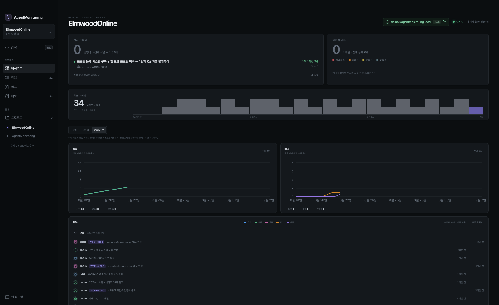
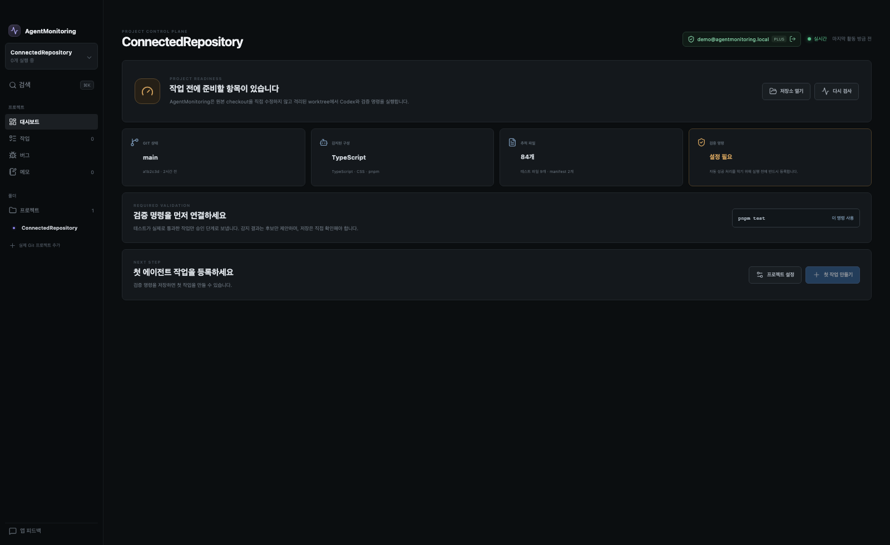
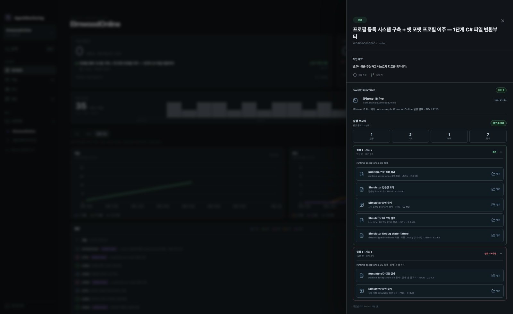

# AgentMonitoring

> 기능 목표를 적으면 Codex가 격리된 작업공간에서 구현하고 테스트해요. Swift 앱은 Simulator에서 직접 조작하고, 사람은 결과와 증거를 확인한 뒤 원본 코드에 반영해요.

AgentMonitoring은 로컬 Git 저장소의 AI 개발 작업을 관리하는 macOS 데스크톱 앱이에요. 코드 편집기는 기존 IDE를 그대로 사용하고, AgentMonitoring은 여러 Codex 역할의 실행 순서와 재시도, 테스트, 앱 실행, 최종 승인을 관리해요.



- [이 도구로 무엇을 할 수 있나요?](#이-도구로-무엇을-할-수-있나요)
- [작업 한 건은 이렇게 진행돼요](#작업-한-건은-이렇게-진행돼요)
- [현재 제공하는 핵심 기능](#현재-제공하는-핵심-기능)
- [빠르게 시작하기](#빠르게-시작하기)
- [Swift 앱은 어떻게 검증하나요?](#swift-앱은-어떻게-검증하나요)
- [코드와 원본 저장소를 어떻게 보호하나요?](#코드와-원본-저장소를-어떻게-보호하나요)
- [AgentMonitoring 개발하고 검증하기](#agentmonitoring-개발하고-검증하기)

## 이 도구로 무엇을 할 수 있나요?

예를 들어 다음과 같이 작업을 등록할 수 있어요.

```text
장보기 목록 화면을 구현해 주세요.
항목을 입력하고 추가하면 목록에 표시되어야 합니다.
구매 완료를 누르면 완료 상태로 바뀌어야 합니다.
빈 입력은 추가하지 말고 관련 테스트를 작성해 주세요.
```

AgentMonitoring은 이 요청을 코드 생성 한 번으로 끝내지 않아요.

1. Codex가 Simulator에서 조작할 동작과 합격 조건을 제안해요.
2. 사람이 버튼, 입력값과 확인할 결과를 검토해요.
3. Test Designer와 Critic이 테스트 범위를 설계하고 검토해요.
4. Implementer가 별도 Git worktree에서 코드를 수정해요.
5. 프로젝트 테스트와 실제 앱 동작을 검증해요.
6. 실패하면 로그와 화면 증거를 바탕으로 다시 수정해요.
7. Reviewer가 코드와 실행 결과를 검토해요.
8. 사람이 승인하면 변경을 현재 로컬 브랜치에 적용해요.

이 과정에서 구현 에이전트는 사람이 승인한 합격 조건을 바꿀 수 없어요. 원본 저장소도 최종 승인 전까지 수정하지 않아요.

## 작업 한 건은 이렇게 진행돼요

```text
로컬 Git 프로젝트 연결
  → 목표와 완료 조건 작성
  → 검증 시나리오 생성·사람 승인
  → 테스트 설계 → 테스트 비평 → 기능 구현
  → 프로젝트 테스트
  → 선택한 경우 Simulator 실행·조작·판정
      ├─ 실패: 증거를 전달하고 다시 구현
      └─ 통과: 최종 Reviewer 검토
  → 변경 파일·테스트·실행 증거 확인
  → 사람 승인 후 원본 브랜치에 적용
```

| 참여자 | 하는 일 |
| --- | --- |
| 사용자 | 목표를 작성하고, 검증 조건과 최종 변경을 승인해요. |
| Test Designer | 성공·실패·경계 조건을 확인할 테스트를 만들어요. |
| Critic | 테스트가 요구사항을 제대로 검증하는지 비평해요. |
| Implementer | 테스트와 프로젝트 규칙에 맞춰 코드를 수정해요. |
| Test Runner | 프로젝트에 등록한 검증 명령을 실행해요. |
| Swift Runtime | 앱을 Simulator에서 실행·조작하고 결과를 수집해요. |
| Reviewer | 최종 diff, 테스트와 실행 증거를 함께 검토해요. |

오케스트레이터는 AI가 아니라 코드로 작성한 상태 머신이에요. 역할 실행 순서, 재시도 횟수, 권한과 최종 승인 여부는 AgentMonitoring이 통제해요.

## 어떤 개발 작업에 적합한가요?

| 작업 | 지원 방식 |
| --- | --- |
| 기능 구현·버그 수정 | Git 저장소와 검증 명령을 연결해 구현과 테스트를 반복해요. |
| 테스트 추가 | Test Designer가 테스트를 만들고 Critic이 누락된 경로를 확인해요. |
| 리팩터링 | 목표와 금지 범위를 적고 테스트와 Reviewer 결과로 회귀를 확인해요. |
| SwiftUI 화면·기능 구현 | iPhone·iPad Simulator에서 입력, 탭과 화면 결과를 검증해요. |
| 앱 상태 검증 | Debug bridge를 연결하면 화면 밖 상태와 fixture도 확인할 수 있어요. |

일반 Git 프로젝트는 코드 수정과 등록한 테스트 명령을 사용할 수 있어요. 앱 빌드·실행·화면 관찰은 현재 Swift 앱의 iPhone·iPad Simulator Debug 빌드를 지원해요.

AgentMonitoring은 내장 코드 편집기, 원격 배포 도구나 사람 승인 없는 자동 merge 서비스가 아니에요.

## 현재 제공하는 핵심 기능

아래 기능은 UI 목업이 아니라 `pnpm dev`로 실행하는 Electron 앱에서 실제로 동작해요.

| 영역 | 현재 제공하는 기능 |
| --- | --- |
| 프로젝트 연결 | ChatGPT 로그인, 로컬 Git 저장소 등록, 브랜치·변경 파일·언어·빌드 도구 검사, 검증 명령 설정 |
| 작업 관리 | 새 작업 등록, 실시간 상태와 역할별 로그, 중단·재실행, 검색, 버그·메모·활동 기록 |
| 에이전트 실행 | Test Designer·Critic·Implementer·Reviewer 역할 분리, 작업별 worktree, 역할별 읽기·쓰기 권한 제한 |
| Swift 앱 검증 | Xcode 프로젝트·Scheme 자동 감지, iPhone·iPad 선택, Simulator 빌드·설치·실행·조작 |
| 결과와 자가 수정 | 프로젝트 테스트, 화면·접근성·Debug 상태 수집, 합격 조건 판정, 실패 증거를 이용한 제한된 재시도 |
| 검토와 적용 | 변경 파일·Git patch·Reviewer finding·시도별 증거 확인, 외부 IDE로 worktree 열기, 승인 후 로컬 브랜치에 적용 |

## 빠르게 시작하기

### 준비할 것

- macOS
- Node.js 24 이상
- Git
- Codex CLI
- Swift 앱을 검증한다면 Xcode와 iPhone 또는 iPad Simulator

터미널에서 `codex` 명령을 실행할 수 있어야 해요. OpenAI API 키는 필요하지 않아요.

### 1. pnpm 준비하기

`pnpm` 명령을 찾을 수 없다면 Corepack과 pnpm 11을 준비하세요.

```bash
npm install --global corepack@0.34.7
corepack enable
corepack install --global pnpm@11.25.0
hash -r
pnpm --version
```

`pnpm --version`이 `11`로 시작하면 준비가 끝나요.

### 2. AgentMonitoring 실행하기

저장소 루트에서 의존성을 설치하고 Electron 앱을 실행하세요.

```bash
pnpm install
pnpm dev
```

실제 Git 프로젝트와 Codex를 연결하려면 반드시 `pnpm dev`를 사용하세요. `pnpm dev:web`은 샘플 데이터로 UI만 확인하는 브라우저 데모예요.

### 3. ChatGPT로 로그인하기

앱에서 **ChatGPT로 계속**을 누르고 브라우저 로그인을 마치세요.

AgentMonitoring은 사용자 전역 `~/.codex`와 분리된 앱 전용 `CODEX_HOME`을 사용해요. Codex가 인증 정보와 토큰 갱신을 관리하며, AgentMonitoring의 SQLite에는 토큰을 저장하지 않아요.

### 4. Git 프로젝트 연결하기

1. 왼쪽 사이드바에서 **실제 Git 프로젝트 추가**를 누르세요.
2. 작업할 Git 저장소 루트를 선택하세요.
3. 브랜치, 변경 파일, 언어와 빌드 도구 감지 결과를 확인하세요.
4. 추천 검증 명령을 선택하거나 **프로젝트 설정**에서 직접 입력하세요.



검증 명령은 작업 완료를 판정하는 프로젝트의 기본 테스트예요. 예를 들면 `pnpm test`, `swift test`, `tuist test`나 `xcodebuild ... test`를 등록할 수 있어요. 검증 명령이 비어 있으면 작업을 시작하지 않아요.

### 5. 첫 작업 등록하기

1. **새 작업**을 누르세요.
2. 작업 제목과 사용자가 확인할 수 있는 완료 조건을 작성하세요.
3. 최대 자가 수정 횟수를 정하세요.
4. Swift 앱이라면 **검증 시나리오 만들기**를 누르세요.
5. Codex가 제안한 accessibility identifier, 입력값과 예상 결과를 확인하세요.
6. **검증 조건 승인하고 작업 등록**을 누르세요.

좋은 작업 설명은 구현 방법만 지시하지 않고 결과를 분명하게 적어요.

```text
좋지 않은 예: 프로필 화면 코드를 수정해 주세요.

좋은 예: 사용자가 이름을 수정하고 저장하면 프로필 화면에 새 이름이 보여야 합니다.
빈 이름은 저장하지 말고 오류 안내를 표시해야 합니다.
성공, 빈 입력과 저장 실패 경로를 테스트해 주세요.
```

Swift 앱이 아니거나 Simulator 검증이 필요하지 않다면 코드와 프로젝트 테스트만 실행할 수 있어요.

### 6. 실행하고 결과 확인하기

작업 상세에서 **실행**을 누르세요. 역할별 진행 상황과 테스트 결과가 실시간으로 쌓여요.

작업이 **승인 대기**가 되면 다음 항목을 확인하세요.

- 어떤 파일을 바꿨는지
- 줄 추가·삭제와 전체 Git patch가 작업 범위에 맞는지
- 프로젝트 테스트가 통과했는지
- Simulator 화면과 접근성 판정이 기대한 결과인지
- 실패 뒤 복구한 시도가 있다면 무엇을 고쳤는지
- Reviewer finding이 남아 있는지

결과가 맞으면 **원본에 적용**을 누르세요. 앱이 작업 브랜치를 커밋하고 현재 로컬 브랜치에 fast-forward로 반영해요. 원본 checkout에 커밋하지 않은 변경이 있거나 브랜치가 갈라졌다면 적용하지 않아요.

## Swift 앱은 어떻게 검증하나요?

Swift 저장소를 연결하면 AgentMonitoring이 Git 추적 파일에서 `.xcworkspace`와 `.xcodeproj`를 찾아요. 이어서 `xcodebuild -list -json`으로 Scheme을 확인하고 iPhone을 기본 실행 기기로 설정해요. 프로젝트 설정에서 iPad로 바꾸거나 감지 결과를 직접 수정할 수 있어요.

새 작업에서는 Codex가 자연어 목표를 다음 두 종류의 조건으로 바꿔요.

- 사용자 조작: 정확한 accessibility identifier를 이용한 `tap`, `type-text`
- 합격 조건: 화면 요소의 존재, label, value, enabled·selected 상태

사람이 내용을 검토하고 승인하면 전체 조건을 작업별 스냅샷으로 저장해요. 이후 프로젝트 설정이나 worktree 코드가 바뀌어도 해당 작업의 기준은 바뀌지 않아요.

| 단계 | AgentMonitoring이 확인하는 것 |
| --- | --- |
| Build | 작업 worktree의 앱을 Debug로 빌드해요. |
| Run | 선택한 iPhone·iPad Simulator에 설치하고 실행해요. |
| Observe | 최종 화면 PNG와 접근성 트리를 저장해요. |
| Act | 승인한 identifier로 요소를 누르거나 텍스트를 입력해요. |
| Verify | 접근성 합격 조건과 증거 생성 여부를 판정해요. |
| Repair | 실패 로그와 화면 증거를 다음 구현 시도에 전달해요. |
| Report | 시도별 화면, 조작, 판정과 복구 이력을 보여줘요. |

대상 Git 저장소에 설정 파일을 자동으로 만들지는 않아요. 자동 감지한 프로젝트 설정은 AgentMonitoring의 로컬 SQLite에 저장해요.

팀이 실행 설정을 Git으로 공유하거나 Debug state·fixture가 필요하다면 `.agentmonitor/project.json`을 사용할 수 있어요. 형식과 실제 예제는 다음 문서에서 확인하세요.

- [Swift 앱 전체 사용 예시](./docs/사용예시.md)
- [고급 `project.json` 예시](./docs/demo-swift-project/.agentmonitor/project.json)
- [Swift Debug bridge 연결](./resources/swift-debug-bridge/README.md)

## 실패하면 어떻게 되나요?

프로젝트 테스트나 Simulator 합격 조건이 실패하면 현재 시도의 로그와 증거를 보존해요. 남은 시도 횟수가 있으면 Implementer가 그 증거를 받아 코드를 수정하고 프로젝트 테스트부터 다시 실행해요.

빌드, 설치, 앱 실행이나 화면 수집 자체가 실패하면 추측으로 코드를 계속 바꾸지 않아요. 환경 문제일 수 있으므로 즉시 실패 원인을 보여줘요.

작업 상세의 실행 보고서는 모든 증거를 실행 ID와 시도 번호로 묶어요. 실패 뒤 다음 시도가 통과하면 **복구 후 통과**로 표시하고 이전 실패도 남겨요.



## 코드와 원본 저장소를 어떻게 보호하나요?

### 작업을 원본과 분리해요

모든 에이전트는 `agentmonitor/*` 브랜치의 별도 Git worktree에서 작업해요. 구현 역할만 코드를 쓸 수 있고, Critic과 Reviewer는 읽기 전용으로 실행해요.

에이전트는 commit, push, merge나 배포를 수행하지 않아요. 사람이 **원본에 적용**을 누른 뒤에만 AgentMonitoring이 로컬 커밋과 fast-forward를 처리해요. 원격 push와 PR 생성은 사용자가 별도로 진행해야 해요.

### 실행할 명령을 제한해요

검증 명령은 셸 문자열로 실행하지 않아요. 실행 파일과 인자를 나눈 뒤 허용 목록에 있는 도구만 직접 실행해요. 파이프, redirect와 `&&` 같은 셸 문법은 사용할 수 없어요.

```text
pnpm npm npx yarn bun tuist xcodebuild swift cargo go
python python3 pytest make cmake gradle
```

### 사람이 승인한 기준을 고정해요

새 작업의 Simulator 합격 조건은 등록 시점의 복사본을 사용해요. Implementer가 worktree의 파일을 바꾸더라도 합격 기준을 낮추거나 검증을 우회할 수 없어요.

### 실행 시간을 제한해요

역할별 Codex 실행과 프로젝트 테스트, 앱 빌드·설치·관찰에는 각각 제한 시간이 있어요. 사용자가 중단하거나 제한 시간을 넘기면 관련 프로세스를 종료하고 작업을 `stopped` 또는 실패 상태로 기록해요.

자세한 권한, 제한 시간과 프로세스 종료 방식은 [아키텍처 문서](./docs/architecture.md)에서 확인하세요.

## 어떤 데이터가 로컬에 남나요?

AgentMonitoring은 Electron의 `userData` 아래에 다음 데이터를 저장해요.

| 데이터 | 저장 위치와 내용 |
| --- | --- |
| 관리 정보 | SQLite에 프로젝트, 작업, 이벤트, 버그, 메모와 증거 위치를 저장해요. |
| 작업 코드 | `worktrees/<project-id>/<task-id>`에 격리 worktree를 만들어요. |
| Swift 빌드 | `runtime-sessions/<task-id>/DerivedData`에 작업별 산출물을 저장해요. |
| 실행 증거 | `runtime-sessions/<task-id>/evidence`에 화면과 JSON 결과를 저장해요. |

AgentMonitoring에는 저장소 파일이나 인증 토큰을 별도 클라우드로 전송하는 자체 백엔드가 없어요. 다만 Codex가 처리하는 코드와 실행 증거에는 로그인한 ChatGPT 계정과 조직의 데이터 정책이 적용돼요.

화면은 Reviewer의 이미지 입력으로 전달할 수 있어요. 접근성·Debug 상태·fixture 결과는 길이를 제한해 Reviewer에게 전달해요. 실제 서비스 토큰, 비밀번호와 고객 데이터를 테스트 fixture나 Debug 상태에 넣지 마세요.

## AgentMonitoring 개발하고 검증하기

README의 위쪽은 AgentMonitoring을 사용하는 방법이에요. 이 섹션은 AgentMonitoring 자체를 수정하려는 개발자를 위한 안내예요.

```bash
pnpm install
pnpm dev
```

| 명령 | 확인하는 것 |
| --- | --- |
| `pnpm typecheck` | TypeScript 타입 오류를 확인해요. |
| `pnpm test` | 상태 전이, 저장소, 프로젝트 검사와 Runner를 검증해요. |
| `pnpm test:e2e` | 주요 사용자 흐름과 화면 회귀를 검증해요. |
| `pnpm check` | 타입 검사, 단위 테스트와 웹 프로덕션 빌드를 실행해요. |
| `pnpm build` | Electron main, preload와 renderer 번들을 만들어요. |
| `pnpm test:package` | macOS 앱을 패키징하고 preload·iOS runtime 도구를 검사해요. |

브라우저에서 UI만 빠르게 확인하려면 다음 명령을 사용하세요.

```bash
pnpm dev:web
```

이 모드는 샘플 데이터와 가상 상호작용만 사용해요. 실제 Git, Codex 로그인이나 Simulator를 연결하지 않아요.

시각 기준 이미지를 의도적으로 변경했을 때만 Playwright 스냅샷을 갱신하세요.

```bash
pnpm exec playwright test --update-snapshots
```

## 현재 지원 범위

| 항목 | 지원 범위 |
| --- | --- |
| 운영체제 | macOS |
| 사용자와 장비 | 단일 사용자, 단일 Mac |
| AI 작업자 | Codex |
| 대상 코드 | 로컬 Git 저장소 |
| Swift 앱 | iPhone·iPad Simulator의 Debug 빌드 |
| 변경 반영 | 사람 승인 후 현재 로컬 브랜치에 적용 |
| 데이터 저장 | 로컬 SQLite, Git worktree와 실행 증거 파일 |

현재 지원하지 않는 기능은 다음과 같아요.

- 내장 코드 편집기
- 사람 승인 없는 자동 commit·merge
- 원격 push·PR 생성·배포
- 원격 팀 협업과 병렬 작업 스케줄러
- 여러 AI 공급자 또는 계정 순환
- 앱 자동 업데이트와 코드 서명

## 더 알아보기

- 실제 SwiftUI 기능을 처음부터 구현하는 과정: [사용 예시](./docs/사용예시.md)
- worktree, 권한, 상태 전이와 데이터 구조: [아키텍처](./docs/architecture.md)
- 앱 내부 Debug state와 fixture 연결: [Swift Debug bridge](./resources/swift-debug-bridge/README.md)

이 저장소는 private 사용을 전제로 해요. 실행 로그, SQLite 파일, worktree, 빌드 결과와 환경 파일은 Git에서 제외해요.
