# AgentMonitoring 사용 예시

Swift 데모 앱을 AgentMonitoring에 연결하고, Codex가 코드를 수정한 뒤 iPhone Simulator에서 직접 조작·검증하는 전체 과정을 따라가요.

이 문서에는 세 가지 예시가 있어요. 첫 번째 예시는 이미 있는 화면의 작은 결함을 수정해요. 두 번째 예시는 새로운 화면과 화면 전환 기능을 구현해요. 세 번째 예시는 장보기 목록에 항목을 추가하고 완료 처리하는 실제 앱 기능을 만들어요. 세 예시 모두 Test Designer가 먼저 완료 조건을 테스트로 만들고, Implementer가 코드를 수정하며, AgentMonitoring이 Simulator 화면과 접근성 트리를 증거로 남겨요.

| 예시 | 작업 | 확인할 수 있는 것 |
| --- | --- | --- |
| 1. 식별자 수정 | 완료 카드에 `completion-card` 추가 | 기존 기능을 안전하게 고치고 회귀를 검증하는 흐름 |
| 2. 화면과 기능 구현 | 메시지와 완료 상태를 보여주는 결과 화면 추가 | 새 UI, 화면 전환, 상태 전달을 구현하고 실제 동작을 검증하는 흐름 |
| 3. 실제 앱 기능 구현 | 장보기 항목 추가와 구매 완료 기능 구현 | 입력, 목록 상태, 사용자 조작이 연결된 기능을 처음부터 만들고 검증하는 흐름 |

예제 소스는 [`docs/demo-swift-project`](./demo-swift-project/)에서 확인할 수 있어요.

> 현재 AgentMonitoring은 Xcode 프로젝트와 Scheme을 자동으로 찾고, 새 작업을 만들 때 Codex가 작업별 검증 시나리오를 제안해요. 아래의 `.agentmonitor/project.json`은 같은 예시를 반복해서 재현하거나 팀에서 고정된 계약을 공유할 때 쓰는 고급 설정이에요. 일반적인 사용에서는 JSON 파일을 직접 만들지 않아도 돼요.

## 준비할 것

- `pnpm dev`로 실행한 AgentMonitoring Electron 앱
- ChatGPT 로그인을 마친 AgentMonitoring 계정
- Git으로 관리하는 SwiftUI 앱
- Xcode와 부팅 가능한 iPhone 또는 iPad Simulator
- 저장소에서 통과하는 검증 명령. 이 예시에서는 생성된 Xcode 프로젝트를 `xcodebuild`로 검증해요.

## 예시 1. 빠진 접근성 식별자 수정하기

첫 번째 예시의 목표는 완료 카드에 빠진 `completion-card` 접근성 식별자를 추가하고, 프로젝트 테스트와 runtime assertion을 모두 통과시키는 거예요.

데모 앱에는 텍스트 입력칸, **검증 시작** 버튼, 버튼을 누른 뒤 나타나는 완료 카드가 있어요. 입력칸과 버튼에는 각각 `demo-message`, `start-verification` 식별자가 있지만, 완료 카드에는 처음부터 `completion-card`를 넣지 않았어요. Codex가 이 누락을 찾아 수정하는 과정을 확인하기 위해서예요.

### 1. Swift 앱에 runtime 계약 추가하기

저장소 루트에 `.agentmonitor/project.json`을 만들어요. 아래 계약은 iPhone Simulator에서 앱을 실행하고, 텍스트 입력과 버튼 탭을 수행한 뒤 완료 카드와 실행 증거를 확인해요.

```json
{
  "version": 1,
  "adapter": {
    "kind": "ios-simulator",
    "container": "AgentMonitoringDemo.xcodeproj",
    "scheme": "AgentMonitoringDemo",
    "configuration": "Debug",
    "deviceFamily": "iphone"
  },
  "capabilities": {
    "build": true,
    "run": true,
    "observe": ["screen", "accessibility"],
    "act": ["ui"],
    "verify": ["test-command", "runtime-scenario"]
  },
  "runtimeScenario": {
    "actions": [
      {
        "kind": "type-text",
        "identifier": "demo-message",
        "text": "AgentMonitoring이 입력한 메시지",
        "timeoutSeconds": 10
      },
      {
        "kind": "tap",
        "identifier": "start-verification",
        "timeoutSeconds": 10
      }
    ],
    "assertions": [
      {
        "kind": "accessibility",
        "name": "완료 카드 표시",
        "identifier": "completion-card",
        "property": "exists",
        "expected": true
      },
      {
        "kind": "evidence",
        "name": "최종 화면 저장",
        "target": "screen"
      },
      {
        "kind": "evidence",
        "name": "접근성 트리 저장",
        "target": "accessibility"
      },
      {
        "kind": "evidence",
        "name": "UI 조작 결과 저장",
        "target": "ui-actions"
      }
    ]
  }
}
```

`container`와 `scheme`은 자신의 Xcode 프로젝트에 맞게 바꾸세요. iPad에서 실행하려면 `deviceFamily`를 `ipad`로 바꾸면 돼요.

### 2. Git 프로젝트 연결하기

AgentMonitoring 왼쪽 아래의 **실제 Git 프로젝트 추가**를 누르고 저장소 루트를 선택해요. 연결 직후에는 브랜치, 추적 파일, Swift 구성, runtime 계약을 자동으로 검사해요.

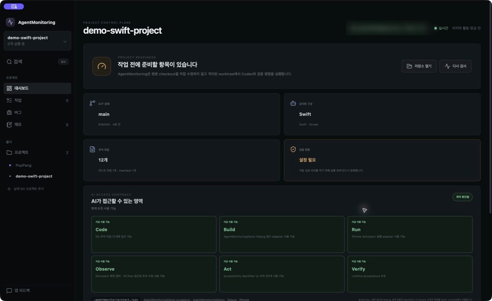

검증 명령이 비어 있으면 **직접 설정**을 눌러 입력해요. 먼저 터미널에서 `xcrun simctl list devices available`을 실행해 사용할 Simulator UDID를 확인하세요. 이 예시에서는 다음 형식의 명령을 저장했어요.

```text
xcodebuild -project AgentMonitoringDemo.xcodeproj -scheme AgentMonitoringDemo -configuration Debug -destination id=<SIMULATOR_UDID> test
```

준비가 끝나면 Code, Build, Run, Observe, Act, Verify가 모두 **지금 사용 가능**으로 표시돼요.

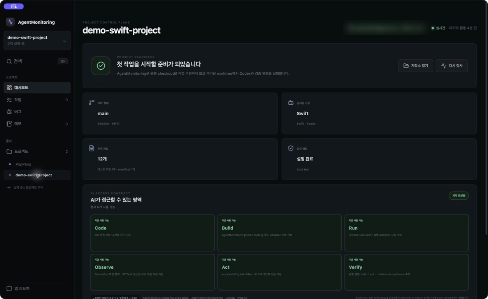

화면을 캡처할 때는 `tuist test`를 먼저 등록했어요. 하지만 AgentMonitoring이 만든 Git worktree에서는 저장소 루트의 `.git`이 디렉터리가 아니라 파일이라 Tuist가 프로젝트 루트를 찾지 못했어요. 그래서 최종 실행에서는 위의 `xcodebuild` 명령처럼 생성된 Xcode 프로젝트를 직접 지정했어요.

여기에서 꼭 확인할 항목은 다음과 같아요.

- Git 상태가 작업을 시작할 수 있는 상태인지 확인해요.
- 검증 명령이 로컬에서 실제로 통과하는지 확인해요.
- Build와 Run에 올바른 scheme과 기기 종류가 표시되는지 확인해요.
- Observe, Act, Verify가 manifest에서 선언한 범위와 같은지 확인해요.

### 3. 작업 목표와 완료 조건 쓰기

**첫 작업 만들기** 또는 **새 작업**을 누르고 사람이 확인할 수 있는 결과를 중심으로 작성해요. 이 예시에서는 다음 내용을 사용했어요.

- 작업 제목: `완료 카드 접근성 식별자 추가`
- 목표와 완료 조건: `검증 버튼을 누른 뒤 나타나는 완료 카드에 accessibility identifier "completion-card"를 지정하세요. 기존 단위 테스트와 AgentMonitoring runtime acceptance가 모두 통과해야 합니다.`
- 최대 자가 수정 횟수: `3`

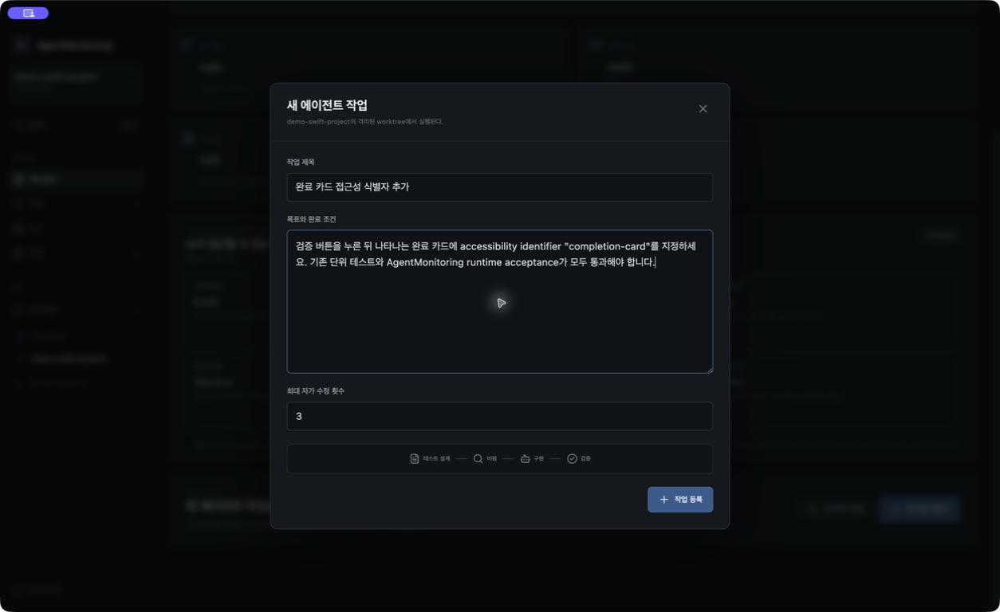

“버튼을 수정해 주세요”처럼 구현 방법만 적기보다, 어떤 동작 뒤에 어떤 상태가 보여야 하고 무엇이 통과해야 하는지 적는 편이 좋아요. 그래야 Test Designer와 Reviewer가 같은 기준으로 결과를 판단할 수 있어요.

### 4. 에이전트 실행 과정 확인하기

작업을 등록한 뒤 상세 화면에서 **실행**을 눌러요. AgentMonitoring은 원본 checkout을 직접 수정하지 않고 별도 worktree와 `agentmonitor/*` 브랜치를 만들어요.

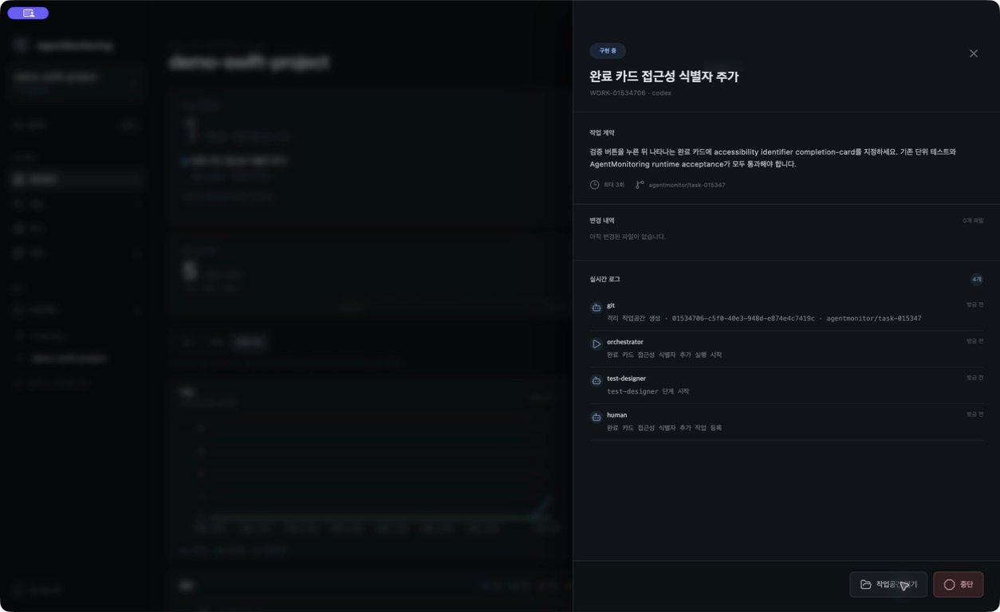

실시간 로그에서 다음 순서를 확인할 수 있어요.

1. Test Designer가 요구사항을 검증할 테스트를 만들어요.
2. Critic이 테스트가 성공·실패·경계 조건을 충분히 다루는지 검토해요.
3. Implementer가 제품 코드를 수정해요.
4. Test Runner가 프로젝트 검증 명령을 실행해요.
5. Swift Runtime이 앱을 빌드하고 Simulator에서 조작·관찰해요.
6. 실패하면 수집한 로그와 증거를 다음 Implementer 시도에 전달해요.
7. 모두 통과하면 Reviewer가 변경 내역을 최종 검토해요.

### 5. Simulator에서 실제 동작 확인하기

프로젝트 테스트가 통과하면 AgentMonitoring이 manifest에서 선택한 기기를 부팅하고 앱을 설치해요. 이어서 `demo-message`에 텍스트를 입력하고 `start-verification` 버튼을 눌러요.

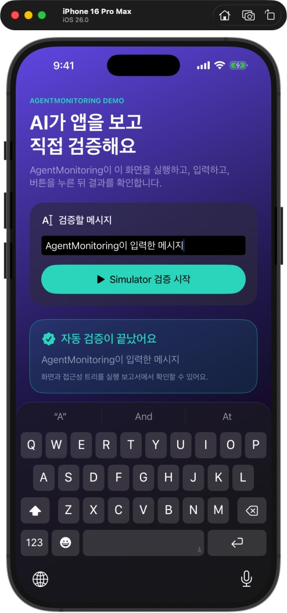

화면에 입력한 메시지와 완료 카드가 함께 보이면 UI 조작은 끝난 거예요. AgentMonitoring은 같은 시점의 화면 PNG와 접근성 트리를 저장하고, `completion-card`가 정확히 하나 존재하는지 판정해요.

### 6. 실행 보고서와 변경 내역 검토하기

작업 상세 화면의 실행 보고서에서 시도별 결과를 확인해요. 화면, 접근성 트리, UI 조작 결과, runtime 판정은 같은 실행 ID와 시도 번호로 묶여요.

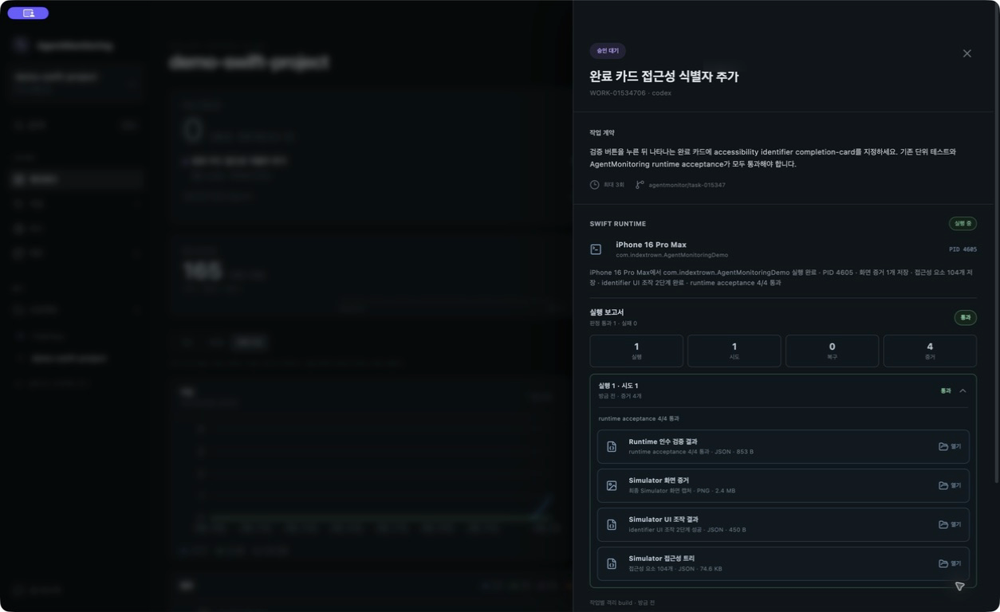

최종 승인 전에는 다음을 확인하세요.

- 프로젝트 검증 명령이 통과했는지 확인해요.
- `completion-card` 접근성 assertion이 통과했는지 확인해요.
- 화면 증거가 기대한 최종 상태인지 확인해요.
- 변경 파일과 Git patch가 작업 범위를 벗어나지 않았는지 확인해요.
- Reviewer finding이 남아 있지 않은지 확인해요.

결과가 맞으면 **원본에 적용**을 눌러 현재 로컬 브랜치에 반영해요. 이 단계는 자동 merge가 아니라 사람의 최종 승인 단계예요. 결과를 사용하지 않으려면 worktree를 폐기하면 원본 저장소는 바뀌지 않아요.

## 예시 2. 검증 결과 화면 구현하기

두 번째 예시는 기존 코드를 조금 고치는 데서 끝나지 않아요. Codex가 새 SwiftUI 화면, 화면을 여는 버튼, 입력 메시지 전달과 닫기 동작을 함께 구현해요. AgentMonitoring은 완성된 화면으로 직접 이동하고, 화면 구조와 상태가 요구사항에 맞는지 확인해요.

완성할 기능은 다음과 같아요.

1. 사용자가 메시지를 입력하고 검증을 시작해요.
2. 검증이 끝나면 **결과 보기** 버튼이 나타나요.
3. 버튼을 누르면 별도의 **검증 결과** 화면이 열려요.
4. 결과 화면에는 입력한 메시지와 `검증 완료` 상태가 보여요.
5. 사용자는 결과 화면을 닫고 이전 화면으로 돌아갈 수 있어요.

### 1. 화면 구현용 runtime 계약 선택하기

데모 프로젝트에는 두 번째 예시용 계약이 [`.agentmonitor/examples/feature-screen.json`](./demo-swift-project/.agentmonitor/examples/feature-screen.json)에 들어 있어요. 데모 프로젝트에서 아래 명령을 실행해 활성 계약으로 바꾸고, AgentMonitoring이 깨끗한 checkout에서 작업을 시작할 수 있게 커밋해요.

```bash
git switch -c tutorial/feature-screen
cp .agentmonitor/examples/feature-screen.json .agentmonitor/project.json
git add .agentmonitor/project.json
git commit -m "chore: select feature screen scenario"
```

이 계약은 다음 순서로 앱을 조작해요.

1. `demo-message`에 `새 화면 구현이 완료됐어요`를 입력해요.
2. `start-verification`을 눌러 검증을 완료해요.
3. 새로 구현할 `open-result`를 눌러 결과 화면으로 이동해요.
4. `result-screen`, `result-message`, `result-status`가 접근성 트리에 존재하는지 확인해요.
5. 최종 화면, 접근성 트리와 UI 조작 결과를 증거로 저장해요.

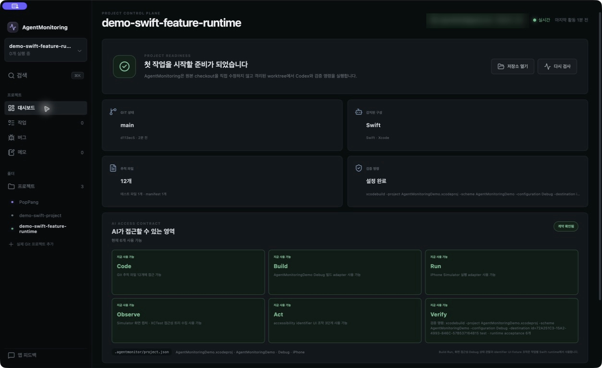

### 2. 구현할 결과를 작업 계약으로 작성하기

**새 작업**을 누르고 아래 작업 계약을 입력해요. 구현 방법보다 사용자가 경험할 동작과 검증 가능한 완료 조건을 구체적으로 적는 것이 중요해요.

```text
검증을 완료한 사용자가 별도의 결과 화면에서 입력 메시지와 완료 상태를 확인할 수 있게 구현하세요.

완료 조건:
- 기존 demo-message 입력과 start-verification 버튼 동작을 유지합니다.
- 검증 완료 후 완료 카드 아래에 “결과 보기” 버튼을 표시하고 accessibility identifier를 open-result로 지정합니다.
- 결과 보기 버튼을 누르면 별도의 SwiftUI 화면을 엽니다. 결과 화면의 최상위 요소에는 result-screen 식별자를 지정합니다.
- 결과 화면에 제목 “검증 결과”, 사용자가 입력한 메시지, 상태 “검증 완료”를 표시합니다. 메시지는 result-message, 상태는 result-status 식별자를 사용합니다.
- 결과 화면을 닫을 수 있는 조작 요소에는 close-result 식별자를 지정합니다.
- 상태 전환과 메시지 보존을 기존 단위 테스트 또는 새 단위 테스트로 검증합니다.
- 기존 xcodebuild 테스트와 AgentMonitoring runtime acceptance 6개가 모두 통과해야 합니다.
- .agentmonitor/project.json을 수정하거나 assertion을 약화하지 마세요.
```

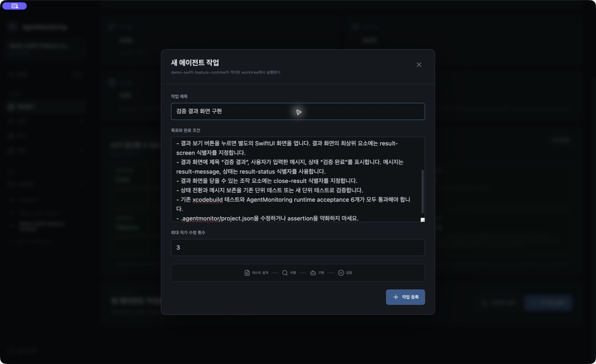

### 3. 테스트와 구현 과정 확인하기

작업을 실행하면 Test Designer가 결과 화면 상태, 메시지 보존과 닫기 동작을 먼저 테스트로 표현해요. Critic이 테스트 범위를 검토한 뒤 Implementer가 화면과 상태 전환을 구현해요.

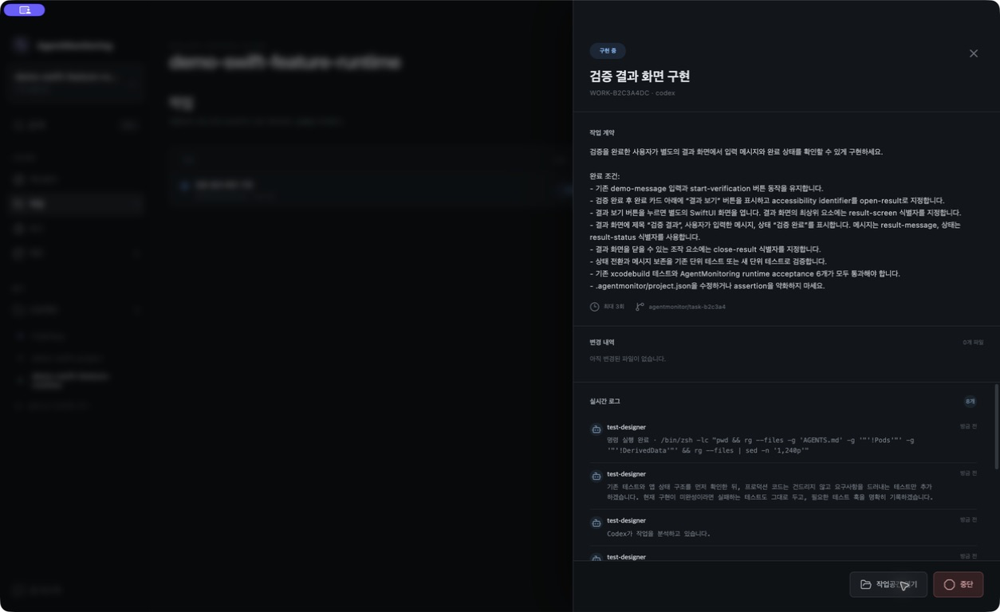

단순한 UI 모양만 만드는 작업이 아니에요. 프로젝트 테스트는 상태 전환을 확인하고, runtime 계약은 실제 사용자가 거치는 화면 흐름을 확인해요. 둘 중 하나라도 실패하면 AgentMonitoring은 해당 증거를 다음 구현 시도에 전달해요.

### 4. 새 화면의 실제 동작 확인하기

프로젝트 테스트가 통과하면 AgentMonitoring이 iPhone Simulator에서 세 번의 UI 조작을 순서대로 실행해요. 마지막에는 Codex가 새로 만든 결과 화면이 열리고, 처음 입력한 메시지와 완료 상태가 함께 보여야 해요.

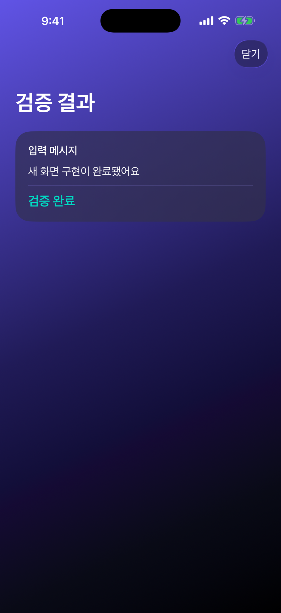

이 화면은 코드 스냅샷이 아니에요. 격리 worktree의 앱을 빌드하고 Simulator에 설치한 뒤, AgentMonitoring이 텍스트 입력과 버튼 탭을 끝낸 실제 실행 결과예요.

### 5. 기능 전체가 통과했는지 검토하기

실행 보고서에서 프로젝트 테스트와 runtime acceptance를 함께 확인해요. UI 조작 3단계가 모두 성공하고, 결과 화면·메시지·완료 상태와 세 종류의 실행 증거가 모두 확인되어야 해요.

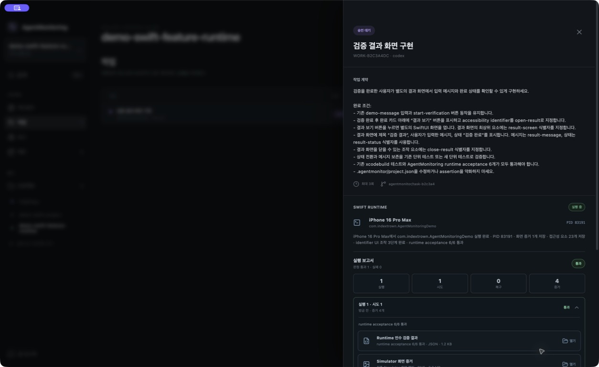

실제 실행에서는 첫 번째 구현 시도에서 프로젝트 테스트가 통과했어요. AgentMonitoring은 iPhone 16 Pro Max에서 UI 조작 3단계를 완료하고 접근성 요소 23개를 수집했으며, runtime acceptance 6개를 모두 통과시켰어요.

최종 승인 전에는 다음을 확인하세요.

- 새 화면이 작업 계약에 적힌 정보만 명확하게 보여주는지 확인해요.
- 입력한 메시지가 결과 화면까지 유지되는지 확인해요.
- 결과 화면을 열고 닫는 동작이 기존 검증 흐름을 깨뜨리지 않는지 확인해요.
- 프로젝트 테스트와 runtime assertion이 모두 통과했는지 확인해요.
- 변경 파일에 manifest assertion을 약화한 수정이 없는지 확인해요.

두 번째 예시는 사용자가 경험할 새 화면을 완료 조건으로 정의하고, 테스트와 실제 화면을 함께 사용해 구현을 검증하는 방법을 보여줘요.

## 예시 3. 장보기 목록 기능 구현하기

세 번째 예시는 실제 앱에서 쉽게 만날 수 있는 장보기 목록을 만들어요. Codex는 빈 화면에 모양만 그리는 것이 아니라 항목 입력, 목록 추가, 구매 완료 상태와 단위 테스트를 함께 구현해요. AgentMonitoring은 완성된 앱에 `우유`를 입력하고 버튼을 눌러 실제 사용 흐름이 이어지는지 확인해요.

완성할 기능은 다음과 같아요.

1. 사용자가 살 항목을 입력해요.
2. **추가**를 누르면 목록에 새 항목이 나타나요.
3. 공백만 입력하면 목록에 추가하지 않아요.
4. **구매 완료**를 누르면 항목이 완료 상태로 바뀌어요.
5. 단위 테스트와 Simulator 실행 결과가 모두 통과해야 해요.

### 1. 장보기 목록용 runtime 계약 선택하기

세 번째 예시용 계약은 [`.agentmonitor/examples/shopping-list.json`](./demo-swift-project/.agentmonitor/examples/shopping-list.json)에 들어 있어요. 데모 프로젝트에서 아래 명령을 실행해 활성 계약으로 바꾸고 커밋하세요.

```bash
git switch -c tutorial/shopping-list
cp .agentmonitor/examples/shopping-list.json .agentmonitor/project.json
git add .agentmonitor/project.json
git commit -m "chore: select shopping list scenario"
```

이 계약은 구현된 앱을 다음 순서로 조작해요.

1. `shopping-item-input`에 `우유`를 입력해요.
2. `add-shopping-item`을 눌러 목록에 추가해요.
3. `shopping-item-toggle`을 눌러 구매 완료로 바꿔요.
4. 화면, 목록 행, 항목 이름과 완료 상태가 접근성 트리에 존재하는지 확인해요.
5. 최종 화면, 접근성 트리와 UI 조작 결과를 증거로 저장해요.

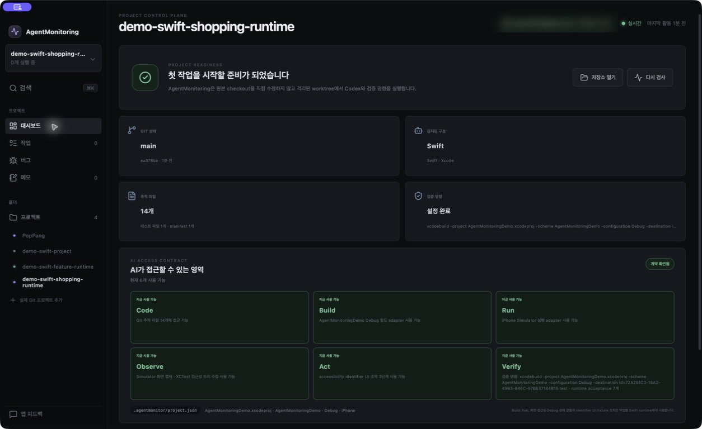

### 2. 사용자가 할 일을 작업 계약으로 작성하기

**새 작업**을 누르고 아래 작업 계약을 입력해요. “장보기 화면을 만들어 주세요”에서 끝내지 않고, 입력과 상태 변화가 언제 일어나야 하는지까지 적어요.

```text
누구나 사용할 수 있는 장보기 목록 화면을 구현하세요.

완료 조건:
- 기존 데모 화면을 “장보기 목록” 화면으로 바꾸고 최상위 요소에 accessibility identifier shopping-list-screen을 지정합니다.
- “살 항목을 입력하세요” 입력창을 만들고 shopping-item-input 식별자를 지정합니다.
- “추가” 버튼을 만들고 add-shopping-item 식별자를 지정합니다.
- 사용자가 항목을 입력하고 추가하면 목록에 새 행이 나타나며 입력창은 비워집니다. 공백만 입력한 항목은 추가하지 않습니다.
- 목록 행에는 shopping-item-row, 항목 이름에는 shopping-item-name 식별자를 지정합니다.
- 각 항목에 “구매 완료” 조작 요소를 제공하고 shopping-item-toggle 식별자를 지정합니다.
- 구매 완료를 누르면 항목이 완료된 모습으로 바뀌고 shopping-item-completed 식별자를 가진 완료 상태가 나타납니다.
- 항목 추가, 빈 입력 거부, 구매 완료 상태 전환을 단위 테스트로 검증합니다.
- 기존 xcodebuild 테스트와 AgentMonitoring runtime acceptance 7개가 모두 통과해야 합니다.
- .agentmonitor/project.json을 수정하거나 assertion을 약화하지 마세요.
```

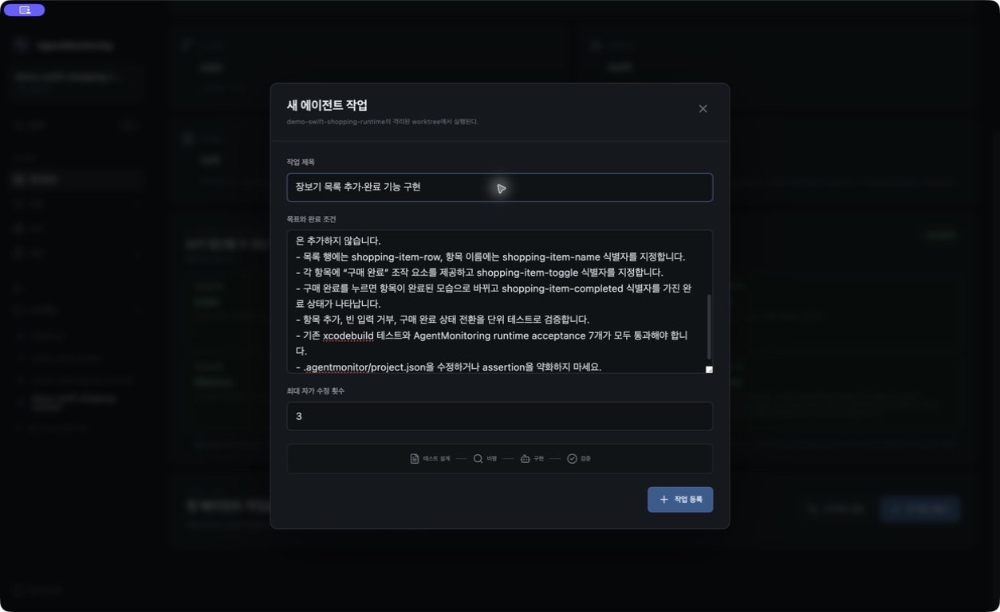

### 3. 테스트가 기능의 빈틈을 찾는지 확인하기

Test Designer는 항목 추가와 완료 전환뿐 아니라 공백 입력도 검사해요. Critic은 공백을 거부한 뒤 입력창 값을 유지할지 비울지 정책이 빠졌다고 지적했어요. Implementer는 공백 입력을 그대로 유지하는 정책을 정하고 테스트에 반영했어요.

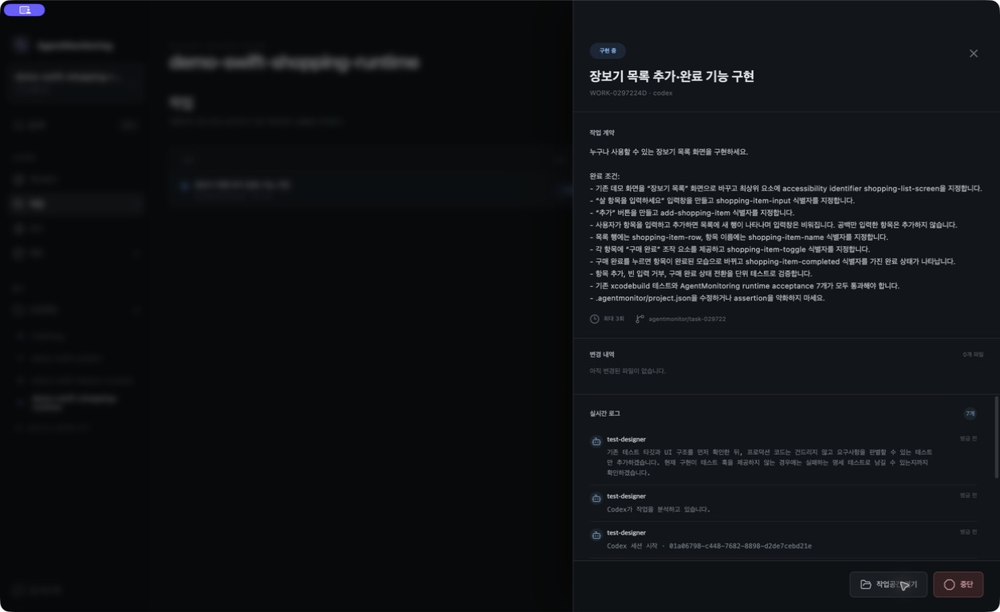

이 과정에서 화면 요구사항은 runtime 계약이 확인하고, 상태 변화와 예외 처리는 단위 테스트가 확인해요. 한쪽만 통과해서는 승인 단계로 넘어가지 않아요.

### 4. Simulator에서 장보기 기능 사용하기

프로젝트 테스트가 통과하면 AgentMonitoring이 iPhone Simulator에서 `우유`를 입력해요. 이어서 **추가**와 **구매 완료**를 차례로 눌러요. 마지막 화면에는 `우유` 항목과 완료 상태가 함께 보여야 해요.

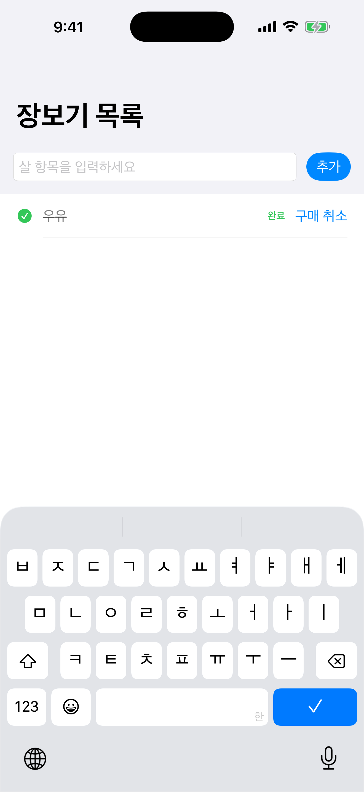

이 화면은 미리 만든 목업이 아니에요. 격리 worktree에서 Codex가 구현한 앱을 빌드하고, AgentMonitoring이 세 번의 UI 조작을 수행한 실제 결과예요.

### 5. 기능 구현 결과 검토하기

실행 보고서에서 프로젝트 테스트와 runtime acceptance를 함께 확인해요. UI 조작 3단계가 성공하고 화면, 항목 이름, 목록 행과 완료 상태가 모두 확인되어야 해요.

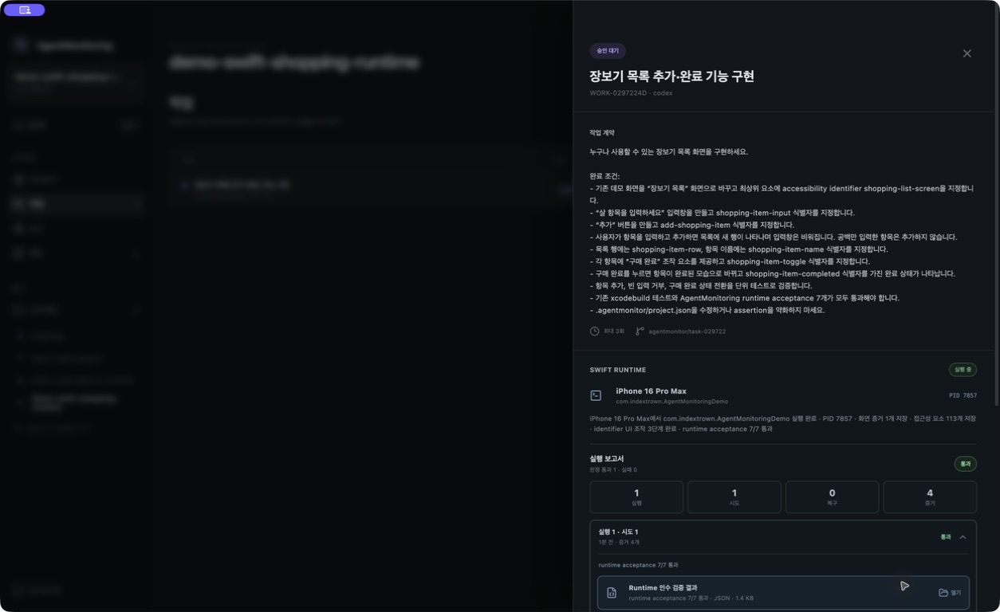

실제 실행에서는 첫 번째 구현 시도에서 프로젝트 테스트가 통과했어요. AgentMonitoring은 iPhone 16 Pro Max에서 UI 조작 3단계를 완료하고 접근성 요소 113개를 수집했으며, runtime acceptance 7개를 모두 통과시켰어요.

최종 승인 전에는 다음을 확인하세요.

- 입력한 `우유`가 목록에 한 번만 추가됐는지 확인해요.
- 입력창이 비워지고 다음 항목을 받을 수 있는지 확인해요.
- 구매 완료 상태가 글자와 아이콘으로 구분되는지 확인해요.
- 공백 입력과 존재하지 않는 항목 같은 예외 조건을 단위 테스트가 다루는지 확인해요.
- `.agentmonitor/project.json`과 runtime assertion이 수정되지 않았는지 확인해요.

첫 번째 예시는 작은 결함을 안전하게 수정하는 흐름을 보여줘요. 두 번째 예시는 화면 전환과 상태 전달을 구현해요. 세 번째 예시는 사용자가 직접 입력하고 상태를 바꾸는 앱 기능 전체를 구현하고 검증해요.

## 자주 막히는 지점

### 프로젝트가 준비 완료로 바뀌지 않아요

검증 명령이 비어 있는지, `.agentmonitor/project.json`이 strict JSON인지, `container`와 `scheme`이 실제 값인지 확인하세요. **다시 검사**를 누르면 현재 저장소 기준으로 준비 상태를 갱신해요.

### Simulator를 찾지 못해요

Xcode에서 해당 iOS runtime과 Simulator가 설치되어 있는지 확인하세요. `deviceFamily`가 `iphone`이면 사용 가능한 iPhone, `ipad`이면 사용 가능한 iPad를 선택해요.

### UI action이 대상을 찾지 못해요

SwiftUI 뷰에 `.accessibilityIdentifier(...)`가 지정되어 있는지 확인하세요. 같은 identifier가 둘 이상이면 안전을 위해 조작을 중단해요. label이나 화면 좌표 대신 manifest와 정확히 같은 identifier를 사용해야 해요.

### 프로젝트 테스트는 통과하지만 runtime이 실패해요

실행 보고서의 화면, 접근성 트리, UI 조작 결과를 같은 시도 번호로 함께 확인하세요. 실패 증거는 다음 자가 수정 시도에도 전달되므로, 최대 시도 횟수 안에서 복구되면 이전 실패와 최종 통과를 모두 비교할 수 있어요.

## 다음으로 읽을 문서

- 전체 기능과 설치 방법: [README](../README.md)
- Swift Debug 상태와 fixture 연결: [Swift Debug bridge 안내](../resources/swift-debug-bridge/README.md)
- worktree, 권한, runtime 증거 구조: [아키텍처](./architecture.md)
